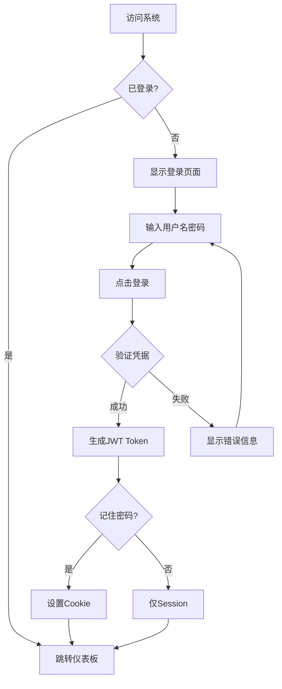
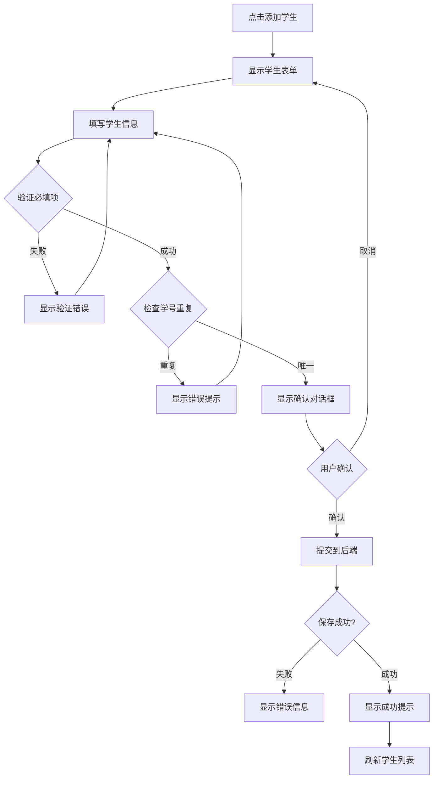
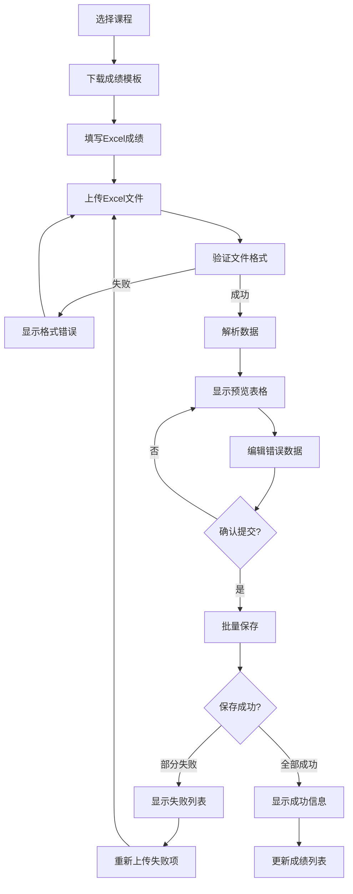
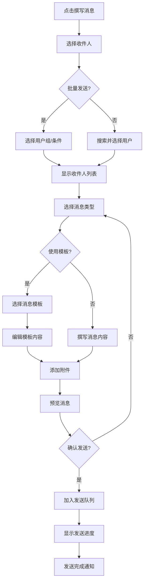

# 学生信息管理系统 UI/UX Specification

## Introduction

This document defines the user experience goals, information architecture, user flows, and visual design specifications for 学生信息管理系统's user interface. It serves as the foundation for visual design and frontend development, ensuring a cohesive and user-centered experience.

### Overall UX Goals & Principles

#### Target User Personas

**系统管理员 (System Administrator)**
- 技术专业人员，负责系统维护、用户管理、数据备份等
- 需要系统控制和管理能力，关注数据安全和系统稳定性
- 工作场景：系统配置、用户权限分配、数据迁移、系统监控

**教务管理人员 (Academic Staff)**
- 行政管理人员，处理大量学生和课程数据
- 需要批量处理能力和工作流程优化
- 工作场景：学生档案管理、成绩录入、课程安排、报表生成

**教师 (Teacher)**
- 教育工作者，需要快速访问学生信息和教学数据
- 关注教学效率和数据分析
- 工作场景：录入成绩、查看学生信息、管理课程、生成教学报告

**学生 (Student)**
- 系统最终用户，关注个人信息和学习进度
- 需要便捷的信息查询和自助管理
- 工作场景：查询成绩、更新个人信息、选课、查看通知

#### Usability Goals
- **易学性**：新用户能在5分钟内完成核心任务
- **效率性**：高频任务最少点击次数完成，批量操作支持
- **错误预防**：明确的验证和确认机制，重要操作二次确认
- **可记忆性**：低频用户无需重新学习，清晰的信息架构
- **满意度**：用户满意度达到90%以上，NPS得分70+

#### Design Principles
1. **简洁胜于巧妙** - 优先清晰的沟通而非美学创新
2. **渐进式展示** - 只在需要时显示所需信息
3. **一致的模式** - 在整个应用中使用熟悉的UI模式
4. **即时反馈** - 每个操作都应有清晰的即时响应
5. **默认可访问** - 从一开始就为所有用户设计

### Change Log
| Date | Version | Description | Author |
|------|---------|-------------|---------|
| 2025-12-13 | 1.0 | Initial UI/UX Specification based on PRD | Sally (UX Expert) |

## Information Architecture (IA)

### Site Map / Screen Inventory

```mermaid
graph TD
    A[登录页面] --> B[仪表板]
    A --> C[用户注册]

    B --> D[用户管理]
    B --> E[学生管理]
    B --> F[课程管理]
    B --> G[成绩管理]
    B --> H[消息中心]
    B --> I[数据导入导出]
    B --> J[报表分析]
    B --> K[系统设置]

    D --> D1[用户列表]
    D --> D2[添加用户]
    D --> D3[编辑用户]
    D --> D4[权限分配]

    E --> E1[学生列表]
    E --> E2[添加学生]
    E --> E3[学生详情]
    E --> E4[批量导入]

    F --> F1[课程列表]
    F --> F2[添加课程]
    F --> F3[课程详情]
    F --> F4[选课管理]

    G --> G1[成绩录入]
    G --> G2[成绩查询]
    G --> G3[统计分析]

    H --> H1[收件箱]
    H --> H2[撰写消息]
    H --> H3[消息模板]
    H --> H4[已发送]

    I --> I1[导入数据]
    I --> I2[导出数据]
    I --> I3[导入历史]

    J --> J1[学生统计]
    J --> J2[成绩分析]
    J --> J3[系统使用报告]

    K --> K1[个人信息]
    K --> K2[修改密码]
    K --> K3[通知偏好]
    K --> K4[操作日志]
```

### Navigation Structure

**Primary Navigation:** 顶部水平导航栏，包含主要功能模块：
- 仪表板 (Dashboard)
- 学生管理 (Student Management)
- 课程管理 (Course Management)
- 成绩管理 (Grade Management)
- 消息中心 (Message Center)
- 数据导入导出 (Data Import/Export)
- 报表分析 (Reports)
- 系统设置 (System Settings)

**Secondary Navigation:** 左侧垂直菜单，显示当前模块的子功能：
- 根据选中的主菜单动态显示
- 支持折叠/展开
- 高亮当前页面

**Breadcrumb Strategy:** 面包屑导航显示完整路径
- 格式：首页 > 模块 > 子模块 > 当前页面
- 支持点击跳转到任意层级
- 清晰显示当前位置

## User Flows

### 用户登录流程

**User Goal:** 安全登录系统获取访问权限

**Entry Points:** 登录页面、会话过期跳转

**Success Criteria:** 用户成功登录，跳转到对应角色的仪表板

#### Flow Diagram

#### Edge Cases & Error Handling:
- 用户名或密码错误：显示红色提示信息
- 账户被锁定：显示联系管理员信息
- 网络错误：显示重试按钮
- 多次登录失败：显示验证码
- 浏览器不支持JavaScript：显示降级提示

### 学生信息录入流程

**User Goal:** 添加新学生到系统

**Entry Points:** 学生管理页面、批量导入入口

**Success Criteria:** 学生信息成功保存，可在列表中查看

#### Flow Diagram

#### Edge Cases & Error Handling:
- 必填字段为空：高亮显示缺失字段
- 邮箱格式错误：实时格式验证
- 学号已存在：检查数据库唯一性
- 上传头像失败：显示默认头像
- 保存时网络断开：显示重试选项

### 成绩批量录入流程

**User Goal:** 快速录入多个学生的成绩

**Entry Points:** 成绩管理页面、课程详情页面

**Success Criteria:** 所有成绩成功保存，生成录入日志

#### Flow Diagram

#### Edge Cases & Error Handling:
- 文件格式不支持：显示支持的格式列表
- 学生不存在：标记为错误，允许修正
- 成绩超出范围：显示警告提示
- 部分保存失败：列出失败项及原因
- 文件过大：提示分批上传

### 消息发送流程

**User Goal:** 创建并发送消息给指定用户

**Entry Points:** 消息中心、用户列表快捷操作

**Success Criteria:** 消息成功发送，接收方收到通知

#### Flow Diagram

#### Edge Cases & Error Handling:
- 收件人邮箱不存在：标记无效地址
- 附件过大：显示大小限制
- 消息内容为空：阻止发送
- 发送队列满：显示稍后重试
- 网络中断：保存到草稿箱

## Wireframes & Mockups

### Design Files
**Primary Design Files:** Figma链接：[待创建]
**Design System:** Element Plus + 自定义组件

### Key Screen Layouts

#### 登录页面 (Login Page)

**Purpose:** 用户身份验证入口

**Key Elements:**
- 左侧：系统Logo和名称
- 中央：登录表单（用户名/邮箱、密码）
- 底部：忘记密码链接、注册链接
- 选项：记住密码、自动登录

**Interaction Notes:**
- 支持Enter键快速登录
- 密码显示/隐藏切换
- 表单验证实时反馈
- 加载状态显示

**Design File Reference:** Figma Frame: Login-001

#### 仪表板 (Dashboard)

**Purpose:** 个性化工作台，展示关键信息和快捷入口

**Key Elements:**
- 顶部：欢迎信息和用户头像
- 左侧：导航菜单
- 中央：信息卡片（待办事项、最新通知、统计数据）
- 右侧：快捷操作按钮
- 底部：系统状态指示器

**Interaction Notes:**
- 卡片支持拖拽排序
- 实时更新通知计数
- 快捷键访问常用功能

**Design File Reference:** Figma Frame: Dashboard-001

#### 学生管理列表 (Student List)

**Purpose:** 查看和管理所有学生信息

**Key Elements:**
- 顶部：搜索栏、筛选器、批量操作
- 中间：学生信息表格
- 分页：页码导航、每页显示数量
- 操作栏：添加、导入、导出按钮

**Interaction Notes:**
- 表格支持排序和列自定义
- Shift+点击多选行
- 右键菜单快捷操作
- 双击查看详情

**Design File Reference:** Figma Frame: StudentList-001

#### 成绩录入表格 (Grade Entry)

**Purpose:** 快速录入和编辑学生成绩

**Key Elements:**
- 左侧：课程信息和学生列表
- 中间：成绩录入表格
- 工具栏：保存、撤销、计算工具
- 状态栏：录入进度提示

**Interaction Notes:**
- Tab键快速切换单元格
- 自动计算平均分和GPA
- 支持公式计算
- 实时保存草稿

**Design File Reference:** Figma Frame: GradeEntry-001

#### 消息中心 (Message Center)

**Purpose:** 管理系统内所有消息通信

**Key Elements:**
- 左侧：文件夹导航（收件箱、已发送、草稿）
- 中间：消息列表
- 右侧：消息详情
- 工具栏：撰写、删除、标记操作

**Interaction Notes:**
- 拖拽移动消息
- 批量标记已读/未读
- 实时新消息提醒
- 搜索和筛选功能

**Design File Reference:** Figma Frame: MessageCenter-001

## Component Library / Design System

### Design System Approach
基于Element Plus组件库，结合自定义主题和教育场景定制组件。确保组件的一致性、可复用性和可维护性。

### Core Components

#### 数据表格 (Data Table)
**Purpose:** 展示和操作结构化数据

**Variants:**
- 标准表格：基础数据展示
- 选择表格：支持行选择和批量操作
- 可编辑表格：单元格内编辑
- 树形表格：层级数据展示

**States:**
- 加载状态：显示骨架屏
- 空状态：无数据提示
- 错误状态：加载失败提示
- 选择状态：高亮选中行

**Usage Guidelines:**
- 表格列宽度可调整
- 固定重要列
- 支持虚拟滚动处理大数据量
- 提供行操作菜单

#### 表单组件 (Form Components)
**Purpose:** 收集用户输入数据

**Variants:**
- 标准表单：基础字段组合
- 分步表单：长表单分步填写
- 动态表单：字段动态增减
- 内联表单：紧凑布局

**States:**
- 初始状态：默认显示
- 验证状态：成功/错误提示
- 提交状态：保存中/成功/失败
- 禁用状态：字段不可编辑

**Usage Guidelines:**
- 必填字段明确标记
- 实时验证反馈
- 错误信息清晰具体
- 支持键盘导航

#### 消息提示 (Message/Notification)
**Purpose:** 系统反馈和用户提醒

**Variants:**
- Toast：临时消息提示
- Alert：重要信息提醒
- Badge：状态标记
- Popover：悬浮信息

**States:**
- 成功：绿色提示
- 警告：黄色提示
- 错误：红色提示
- 信息：蓝色提示

**Usage Guidelines:**
- 消息文本简洁明了
- 提供关闭选项
- 自动消失时间合理
- 支持批量显示

#### 导航组件 (Navigation)
**Purpose:** 页面和功能导航

**Variants:**
- 顶部导航：主导航菜单
- 侧边导航：二级功能菜单
- 面包屑：路径导航
- 标签页：页面内容切换

**States:**
- 默认：正常显示
- 激活：当前选中状态
- 悬停：鼠标悬停效果
- 禁用：不可点击状态

**Usage Guidelines:**
- 导航层级不超过3层
- 图标和文字结合
- 响应式适配移动端
- 支持键盘快捷键

## Branding & Style Guide

### Visual Identity
**Brand Guidelines:** 待创建完整品牌指南文档

### Color Palette

| Color Type | Hex Code | Usage |
|------------|----------|-------|
| Primary | #2C3E50 | 主导航、重要按钮、标题文字 |
| Secondary | #3498DB | 链接、辅助按钮、高亮元素 |
| Accent | #3498DB | 强调色、交互元素、状态指示 |
| Success | #27AE60 | 成功状态、确认操作、正向反馈 |
| Warning | #F39C12 | 警告提示、需要注意的信息 |
| Error | #E74C3C | 错误状态、删除操作、负面反馈 |
| Neutral | #95A5A6 | 次要文字、边框、分割线 |
| Background | #FFFFFF | 页面背景、卡片背景 |
| Surface | #F8F9FA | 次级背景、区块背景 |

### Typography

#### Font Families
- **Primary:** 思源黑体 (Source Han Sans), -apple-system, BlinkMacSystemFont, "Segoe UI", Roboto
- **Secondary:** "PingFang SC", "Microsoft YaHei", sans-serif
- **Monospace:** "SF Mono", Monaco, Inconsolata, "Roboto Mono", monospace

#### Type Scale

| Element | Size | Weight | Line Height |
|---------|------|--------|-------------|
| H1 | 32px | 600 | 1.5 |
| H2 | 24px | 600 | 1.5 |
| H3 | 20px | 600 | 1.5 |
| H4 | 18px | 600 | 1.5 |
| Body | 14px | 400 | 1.5 |
| Small | 12px | 400 | 1.5 |
| Caption | 11px | 400 | 1.5 |

### Iconography
**Icon Library:** Element Plus Icons + 自定义教育图标

**Usage Guidelines:**
- 保持图标风格一致
- 使用有意义的图标
- 提供文字标签说明
- 考虑无障碍访问

### Spacing & Layout
**Grid System:** 24列响应式栅格系统

**Spacing Scale:**
- xs: 4px
- sm: 8px
- md: 16px
- lg: 24px
- xl: 32px
- xxl: 48px

## Accessibility Requirements

### Compliance Target
**Standard:** WCAG 2.1 AA级别

### Key Requirements

**Visual:**
- Color contrast ratios: 正常文本4.5:1，大文本3:1
- Focus indicators: 2px实线边框，高对比度
- Text sizing: 支持200%缩放不失功能

**Interaction:**
- Keyboard navigation: 所有功能可通过Tab键访问
- Screen reader support: 语义化HTML，ARIA标签
- Touch targets: 最小44x44px点击区域

**Content:**
- Alternative text: 所有图片提供描述性alt文本
- Heading structure: 合理的标题层级（h1-h6）
- Form labels: 所有表单字段有关联标签

### Testing Strategy
- 使用axe-core自动化测试
- 手动键盘导航测试
- 屏幕阅读器测试（NVDA, JAWS）
- 色盲模拟测试
- 响应式无障碍测试

## Responsiveness Strategy

### Breakpoints

| Breakpoint | Min Width | Max Width | Target Devices |
|------------|-----------|-----------|----------------|
| Mobile | 320px | 768px | 手机设备 |
| Tablet | 768px | 1024px | 平板设备 |
| Desktop | 1024px | 1440px | 桌面显示器 |
| Wide | 1440px | - | 大屏显示器 |

### Adaptation Patterns

**Layout Changes:**
- 移动端：单列布局，卡片式设计
- 平板端：双列布局，侧边栏可收起
- 桌面端：多列布局，充分利用空间

**Navigation Changes:**
- 移动端：汉堡菜单，底部标签栏
- 平板端：折叠侧边栏
- 桌面端：完整导航栏

**Content Priority:**
- 移动端：优先核心功能
- 平板端：显示辅助信息
- 桌面端：完整功能展示

**Interaction Changes:**
- 移动端：触摸友好，手势支持
- 平板端：混合交互模式
- 桌面端：键盘快捷键，鼠标悬停

## Animation & Micro-interactions

### Motion Principles
- **功能性**：动画服务于功能，而非装饰
- **快速响应**：动画时长控制在200-500ms
- **自然流畅**：使用标准缓动函数
- **性能优先**：优先使用CSS动画和transform

### Key Animations
- **页面切换**：淡入淡出效果 (Duration: 300ms, Easing: ease-in-out)
- **列表展开**：高度动画过渡 (Duration: 250ms, Easing: ease-out)
- **表单验证**：抖动错误提示 (Duration: 500ms, Easing: ease-in-out)
- **加载状态**：旋转加载指示器 (Duration: 1000ms, Easing: linear)
- **悬停效果**：按钮状态变化 (Duration: 200ms, Easing: ease-out)
- **模态框**：缩放+淡入效果 (Duration: 300ms, Easing: ease-out)
- **消息提示**：滑入滑出动画 (Duration: 400ms, Easing: ease-in-out)

## Performance Considerations

### Performance Goals
- **Page Load:** 首屏加载时间 < 2秒
- **Interaction Response:** 交互响应时间 < 100ms
- **Animation FPS:** 动画帧率保持60fps

### Design Strategies
- 使用SVG图标代替图片
- 懒加载非关键资源
- 优化图片大小和格式
- 减少动画复杂度
- 使用虚拟滚动处理长列表
- 预加载关键资源
- 实施资源缓存策略

## Next Steps

### Immediate Actions
1. 创建Figma设计文件，包含所有关键页面
2. 设计组件库，建立设计系统
3. 进行用户测试，验证设计方案
4. 与开发团队协作，确保技术可行性
5. 准备设计交付文档

### Design Handoff Checklist
- [x] All user flows documented
- [x] Component inventory complete
- [x] Accessibility requirements defined
- [x] Responsive strategy clear
- [x] Brand guidelines incorporated
- [x] Performance goals established
- [ ] Interactive prototype created
- [ ] User testing completed
- [ ] Developer handoff prepared